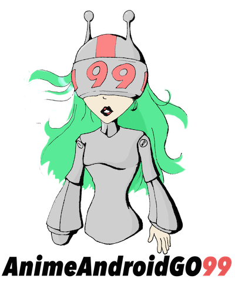

Tools to make building complex animations on Android more pleasant.

# Introduction

Android has pretty decent APIs available for building animations, but they tend to be fragmented, and coordinating more than a couple quickly becomes a burden. anime-android-go-99 provides tools to make it easier to create consistent animations, and act on them as a whole.

# Using AnimeAndroidGo99

## Animator contexts

One of the core building blocks of AnimeAndroidGo99 is `AnimatorContext`. With an AnimatorContext you can easily execute a group of animations together, apply timing constraints, and schedule expensive main thread operations.

## Creating an animator context

When creating an `AnimatorContext`, it should be tied to the lifecycle of a major UI component of your application. A decent place to start is within your activity:

```java
// The Scene interface provides a standard way to access a UI component's animator context
class MainActivity extends Activity implements AnimatorContext.Scene {
    private final AnimatorContext animatorContext = new AnimatorContext("MainActivity");
    
    @Override
    public AnimatorContext getAnimatorContext() {
        return animatorContext;
    }
}
```

## Coordinating animations

Efficiently coordinating multiple animations can quickly grow your code out of control with the standard Android APIs. Transactions to the rescue! With a transaction, you can easily coordinate several animations to fire in tandem, and be notified when they're all finished.

```java
getAnimatorContext().transaction(transaction -> {
    transaction.animatorFor(image)
               .scale(0f)
               .alpha(0f);
    transaction.animatorFor(title)
               .translationY(slideAmount)
               .alpha(0f);
}, finished -> {
    if (finished) {
        image.setVisibility(View.GONE);
        title.setVisibility(View.GONE);
    }
});
```

## Easy consistency

AnimeAndroidGo99 tries to provide the best sensible defaults, but they don't fit every situation. With an AnimatorContext, you can set one attribute, and all of your animations will have consistent timing.

```java
final AnimatorTemplate template = AnimatorTemplate.DEFAULT
          .withDuration(350L)
          .withInterpolator(new AccelerateDecelerateInterpolator());
getAnimatorContext().setTransactionTemplate(template);
```

## Simple scheduling

Coordinating groups of animations can be a pain. One of the tools provided by AnimeAndroidGo99 is AnimatorContext's concept of idleness. When you associate animations with an animator context, the context will track when all animations are completed, and then fire any Runnables you give it. This allows you to easily defer expensive main thread work, and schedule further animations.

```java
getAnimatorContext().runWhenIdle(() -> {
    bindExpensiveAdapter();
    runNextAnimation();
});
```

# Animator templates

Mentioned briefly above in the « Easy consistency » section, animator templates encapsulate basic timing information about animations, and allow you to quickly ensure all of your animations are consistent. Of course, the easiest way to do this is to specify a transaction template for AnimatorContext, but sometimes you have animations that will run separately. There are two main ways to use an animator template:

## As a factory

Animator templates include a couple of factory methods to vend common ValueAnimator configurations that are inconvenient to use.

```java
final ValueAnimator textColorAnimator = AnimatorContext.DEFAULT.createColorAnimator(Color.RED, Color.BLUE, Color.GREEN);
textColorAnimator.addUpdateListener(a -> {
    final @ColorInt int color = (int) a.getAnimatedValue();
    textView.setTextColor(color);
});
textColorAnimator.start();

final ValueAnimator rectAnimator = AnimatorContext.DEFAULT.createRectAnimator(start, end);
rectAnimator.addUpdateListener(a -> {
    final Rect rect = (Rect) a.getAnimatedValue();
    entity.setBounds(rect);
});
```

## As a template

Animator templates include an apply method for most animators provided by AnimeAndroidGo99 and the Android SDK.

```java
template.apply(textColorAnimator);
template.apply(getLayoutTransition());
template.apply(oldFashionedAnimation);
```

# Download

## Gradle

```groovy
repositories {
    maven { url 'https://dl.bintray.com/hello-inc/maven' }
}

dependencies {
    compile 'is.hello:anime-android-go-99:0.4.0'
}
```

# Contributing

If you'd like to contribute to `anime-android-go-99`, fork the project on GitHub, and submit a pull request with your changes. Please be sure to include unit tests for any changes you make, and follow the coding style of the project as closely as possible. The full contribution guidelines can be found [here](https://github.com/hello/anime-android-go-99/blob/master/CONTRIBUTING.md).

# License

	Copyright 2015 Hello Inc.
	Licensed under the Apache License, Version 2.0 (the "License");
	you may not use this file except in compliance with the License.
	You may obtain a copy of the License at
	
	   http://www.apache.org/licenses/LICENSE-2.0
	
	Unless required by applicable law or agreed to in writing, software
	distributed under the License is distributed on an "AS IS" BASIS,
	WITHOUT WARRANTIES OR CONDITIONS OF ANY KIND, either express or implied.
	See the License for the specific language governing permissions and
	limitations under the License.
